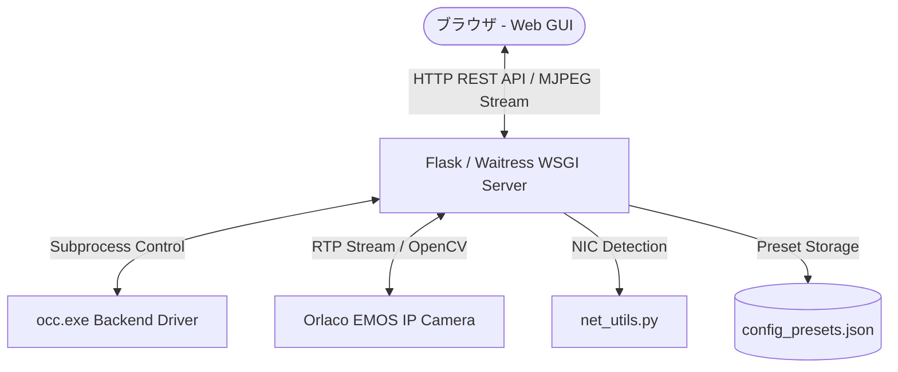

# 🎥 OCC-Web — Orlaco EMOS Camera Configurator GUI

[](https://python.org)
[](https://flask.palletsprojects.com/)
[](https://opencv.org/)
[](LICENSE)
[](https://www.microsoft.com/windows)

**産業用 [Orlaco EMOS IP カメラ](https://github.com/Codemonkey1973/OCC) の設定変更およびリアルタイム映像プレビューを、Webブラウザから直感的に行える高信頼性ポータブルGUIシステムです。**

---

## 🌟 主な機能 (Key Features)

| 機能 | 詳細 |
| :--- | :--- |
| 🎥 **リアルタイム映像プレビュー & 産業用 OSD** | カメラからの RTP ストリーム（H.264 / MJPEG）をイベント駆動で超低遅延表示。ファインダー風レティクル枠線、LIVEバッジ、タイムコード、全画面・静止画キャプチャ対応。 |
| 💓 **省電力ハートビート & クリーンアップ** | プレビュー非表示時はストリームデコードを自動停止し、ブラウザ終了時は一時ファイル削除と安全な Graceful Shutdown を実行。 |
| 🌐 **マルチNIC自動検出 & ヘッダーバッジ** | 有線LANとWi-Fiが混在する現場PCでも、カメラ接続用のLANアダプターを選択するだけでIP・ブロードキャストIPを自動補完し、ヘッダーに常時表示。 |
| 🛡️ **文鎮化防止ガード** | PCのIPと異なるサブネットへの変更時に警告ダイアログを表示し、誤設定による通信不能を未然に防止。 |
| 💾 **設定プリセット & JSON入出力** | ブラウザ内保存に加え、設定一式を `.json` ファイルとしてエクスポート/インポート可能。チーム内共有やバックアップを支援。 |
| 🔍 **カメラ自動発見** | ブロードキャストスキャンでネットワーク上のカメラを自動検出。 |
| ⚙️ **映像設定 (ROI)** | 解像度・FPS・コーデック・ビットレート・センサー切り取り範囲（ROI）をフォームとスライダーで調整。 |
| 🔄 **設定反映 & 自動再起動催促** | 設定送信後、自動的に再起動を催促し、ワンクリックで再起動コマンドを実行。 |
| 📋 **詳細レジスタ編集** | 全レジスタ一覧の確認および1バイト単位の直接書き込み。 |
| 🚀 **完全ポータブル仕様** | フォルダごと別PCにコピーして `start.bat` をダブルクリックするだけで、仮想環境作成からブラウザ起動まで自動完了。 |


---

## 🏗️ システム構成 (Architecture)



---

## 📁 ディレクトリ構成 (Directory Structure)

```
occ-web/
├── start.bat                   # 起動バッチ（ダブルクリックで起動）
├── LICENSE                     # MIT License
├── README.md                   # 本ドキュメント
└── system/                     # システム内部フォルダ
    ├── README.md               # 詳細解説書
    ├── STRUCTURE_AND_CUSTOMIZE.md # システム構成・カスタマイズ解説
    ├── backend/                # Python バックエンド (Flask + Waitress + OpenCV)
    │   ├── app.py              # API サーバー & WSGI エントリポイント
    │   ├── occ_wrapper.py      # occ.exe ラッパー
    │   ├── streamer.py         # RTP 映像受信 & 配信（省電力ハートビート付）
    │   ├── net_utils.py        # NIC 検出 & IP 計算ユーティリティ
    │   ├── occ.exe             # 通信バイナリ (配置済み)
    │   └── requirements.txt    # 依存ライブラリ一覧
    └── frontend/               # Web フロントエンド
        ├── index.html          # HTML 構造
        ├── style.css           # UI スタイル
        └── app.js              # フロントエンド制御ロジック
```

---

## 🚀 クイックスタート (Quick Start)

### 動作要件
* **OS**: Windows 10 / 11 (64-bit)
* **Python**: Python 3.10 以上（`python.exe` が PATH に通っていること）

### 起動手順
1. 本リポジトリをダウンロードまたはクローンします。
   ```bash
   git clone https://github.com/Shuntaro1996/occ-web.git
   ```
2. フォルダ内の **`start.bat`** をダブルクリックします。
   * 初回起動時に自動で仮想環境（`.venv`）が作成され、必要な依存ライブラリがインストールされます。
3. 自動的にブラウザが立ち上がり、操作画面（`http://localhost:5000`）が表示されます。

---

## 💡 カメラ動作ボタンの仕様

| ボタン | コマンド | 説明 |
| :--- | :--- | :--- |
| **▶ 配信開始** | `-m start` | カメラからの RTP 映像配信（ストリーミング）を開始します。 |
| **⏹ 配信停止** | `-m stop` | 映像配信を停止し、カメラをスタンバイ状態にします。 |
| **🔄 再起動** | `-m restart` | カメラ本体のマイコンをソフトリブートします。**設定変更を反映させるために必須です。** |

---

## 📖 ドキュメント (Documentation)

* **システム構造・カスタマイズ詳細**: [system/STRUCTURE_AND_CUSTOMIZE.md](system/STRUCTURE_AND_CUSTOMIZE.md)
* **内部仕様書**: [system/README.md](system/README.md)

---

## 👤 作成者 (Author)

* **GitHub**: [@Shuntaro1996](https://github.com/Shuntaro1996)

---

## 📄 ライセンス (License)

本プロジェクトは [MIT License](LICENSE) のもとで公開されています。
